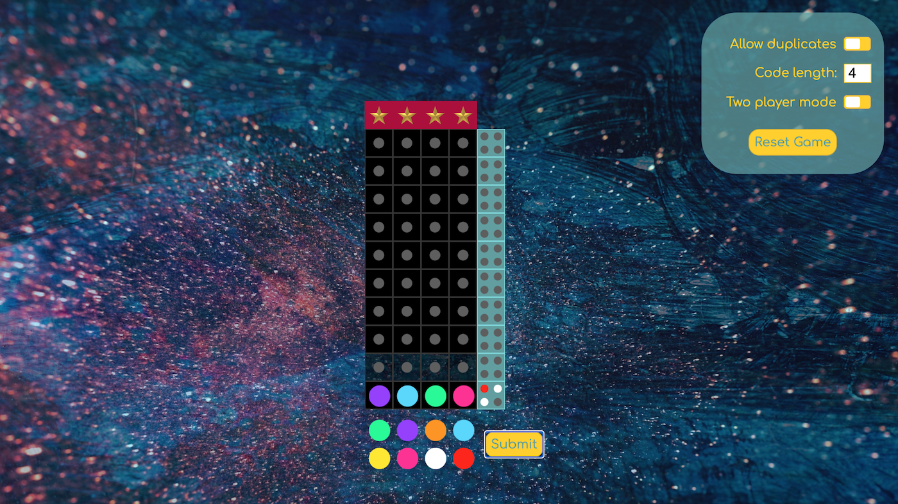
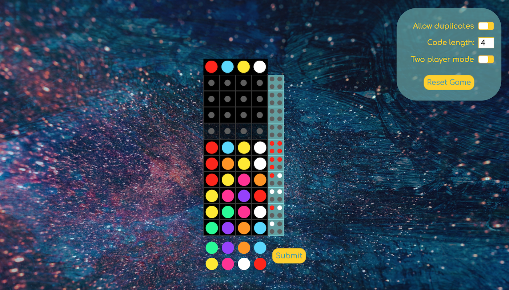
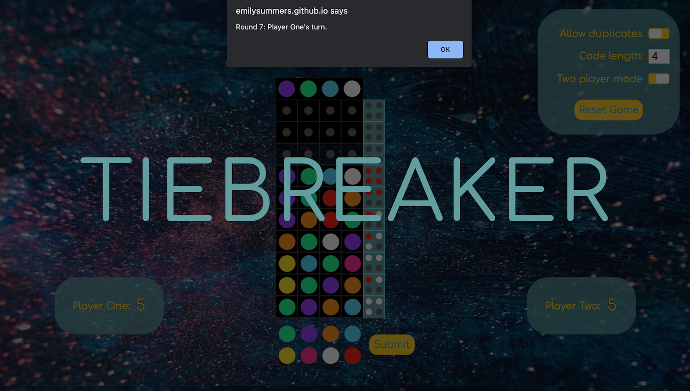
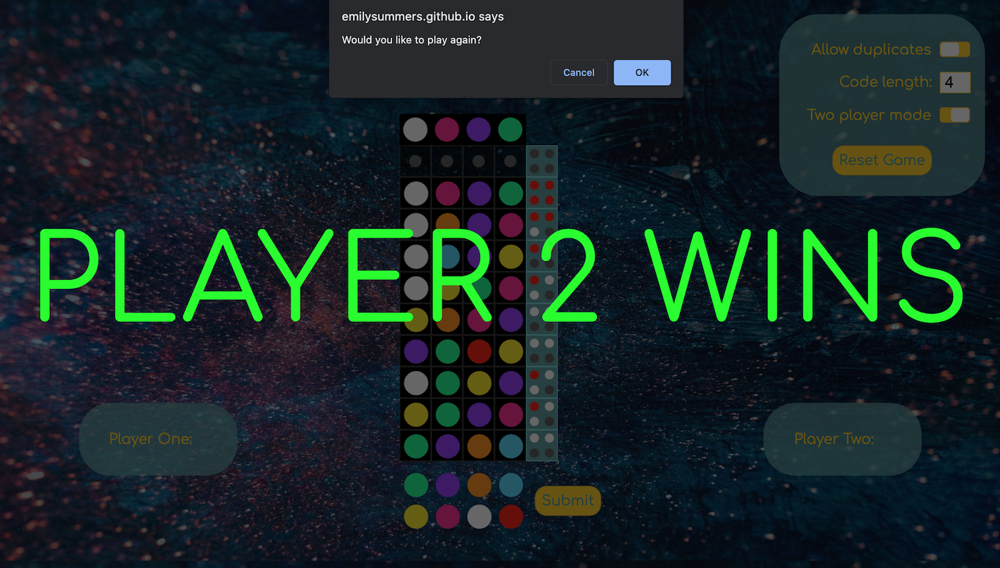

# Software Engineering Immersive: Project 1

This is the first project I completed during the General Assembly Software Engineering Immersive course (Week 4).

---

# Mastermind

This project is a browser game version of the board game Mastermind, built using Vanilla JavaScript.

## Built With

* HTML5
* CSS
* JavaScript
* GitHub

## Deployment

This game is deployed on GitHub pages and can be found here: https://emilysummers.github.io/sei-project-1/

## Getting Started

Use the clone button to download the game source code. Open the index.html file in your browser and the game should start. If not, check your console for any issues.

## Game Architecture

Mastermind is a logic game where players try to guess a randomly generated colour sequence. Players have 10 guesses to crack the code and can adjust the difficulty by increasing the code length and/or allowing duplicate colours. There is also a two-player mode which involves player rounds and a tiebreaker.

When a new game is started, a random colour sequence is generated for the player to guess. Each colour in the sequence is determined by generating a random number between 0 and 8, with each number relating to a different colour. This is repeated until the code is the correct length, with or without duplicate colours depending on what option the player has chosen.



When a player submits a guess, their sequence is scored using a mixture of red and white pegs:
- A red peg is displayed if the colour is correct and in the right position
- A white peg is displayed if the colour is correct but in the wrong position
- No peg is awarded if the colour is incorrect

The score pegs are sorted into the above order so that the player does not know which score peg relates to which colour.

The below snippet shows the functions that calculate the score each time a player submits a guess:

```js
function calculateScore() {
    spacesInPlay.forEach(spaceInPlay => selectedColors.push(spaceInPlay.getAttribute('class')))
    for (let i = 0; i < width; i++) {
      const codeColor = codeSequence[i].getAttribute('value')
      const guessedColor = spacesInPlay[i].getAttribute('class')
      if (codeColor === guessedColor) {
        score.push('red-peg') 
      } else if (selectedColors.includes(codeColor)) {
        score.push('white-peg') 
        const index = selectedColors.indexOf(codeColor)
        selectedColors.splice(index, 1) // ensures multiple points are not received for one color
      }
    }
  }

  function displayScore() {
    score.sort()
    const lineScore = scoreSpacesInPlay.map((scoreSpace, i) => {
      while (i < score.length) return scoreSpace.className = score[i]
    })
    return lineScore
  }
```
The below function then runs to determine whether the game should continue or end. The game ends if a player wins the game by guessing the colour sequence or loses by running out of turns:

```js
  function winOrLose() {
    if (score[width - 1] === 'red-peg') {
      revealCode()
      youWin()
      setTimeout(function () {
        if (twoPlayers === 'flex-end') {
          addScore()
          twoPlayerResult()
        } else {
          playAgain()
        }
      }, 500)
    } else if (i > ((width * height) - 1) && score[width - 1] !== 'red-peg') {
      revealCode()
      gameOver()
      setTimeout(function () {
        twoPlayers === 'flex-start' ? playAgain() : twoPlayerResult()
      }, 500)
    }
  }
```
When the game ends, the code is revealed to the player:



### **Two-player mode**

If two-player mode is activated, the players take it in turns to play rounds, receiving 1 point every time they win a round. The first player to 5 points wins the game. To prevent Player 1 from having an unfair advantage due to going first, if they reach 5 points first, Player 2 gets to play their round before a winner is determined. If both players reach 5 points, there is a tiebreaker round and the game continues until a player loses a game. 



The below functions determine whether there is a winner after each game in two-player mode and the tiebreaker round:

```js
  function checkForWinner() {
    if (playerOne === 5 && playerTwo === 5) {
      tieBreakerAlert()
      tiebreaker = true
    } else if (playerOne === 5 && playerTwo === 4 && gameCount % 2 === 0) {
      playerOneWins()
      gameWon = true
      twoPlayerReset()
      playAgain()
    } else if (playerTwo === 5 && playerTwo > playerOne) {
      playerTwoWins()
      gameWon = true
      twoPlayerReset()
      playAgain()
    } else if (playerOne === 5 && playerTwo < 4 && gameCount % 2 !== 0) {
      playerOneWins()
      gameWon = true
      twoPlayerReset()
      playAgain()
    }
  }

  function tiebreakerWinner() {
    if (tiebreaker === true && gameCount % 2 === 0) { 
      if (playerOne > playerTwo) {
        playerOneWins()
        gameWon = true
        twoPlayerReset()
        playAgain()
      } else if (playerTwo > playerOne) {
        playerTwoWins()
        gameWon = true
        twoPlayerReset()
        playAgain()
      }
    }
  }
```


## Wins and Key Learnings

- A key learning from this project was how essential logging to the console is when debugging. When trying to check whether a function was executing or if a variable had the correct value, I soon learnt that the console was my best friend.

- As this was my first project, the thought of building an entire game on my own felt overwhelming at first, but I learnt that breaking the project down into smaller chunks and focussing on solving one small issue at a time made the entire project much more manageable. Rather than building large, complex functions, I tried to ensure that each function had a single responsibility. Piecing all of these elements together to create my first fully functioning game was a huge win for me.

## Challenges and Future Improvements

- One problem I met during this project was the possibility of user error. I had to create a function to prevent players from inputting their sequence into the incorrect row on the board and a function to check for any empty spaces or duplicates in the user's submitted sequence (in non-duplicate rounds). Having to think about any potential ways the user could make a mistake, and account for those errors, was definitely a new challenge for me.

- A future improvement I would like to make is to implement a high score or leader board feature to add a more competitive element to the game. This would allow users to keep track of their previous scores and either aim to beat their personal best or compete against other players.

- Another change I would like to make to bring the game more in-line with the real board game, is to allow for players to pick the code sequence for their opponent during the two-player mode. This would ensure that both players are involved in each round.

